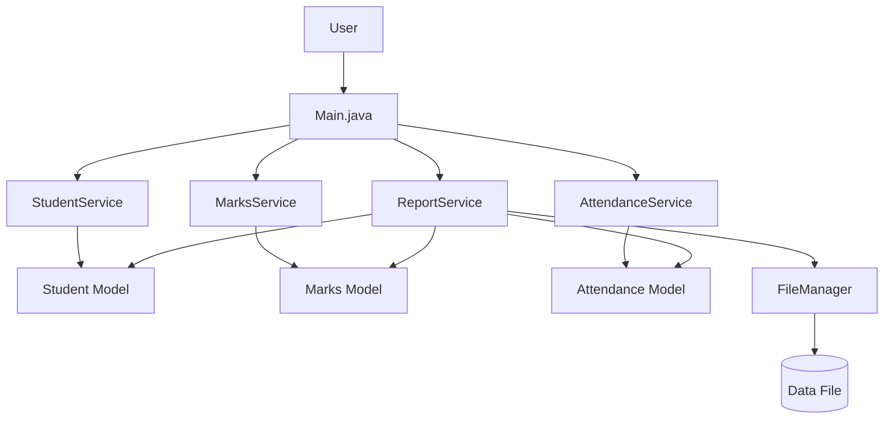
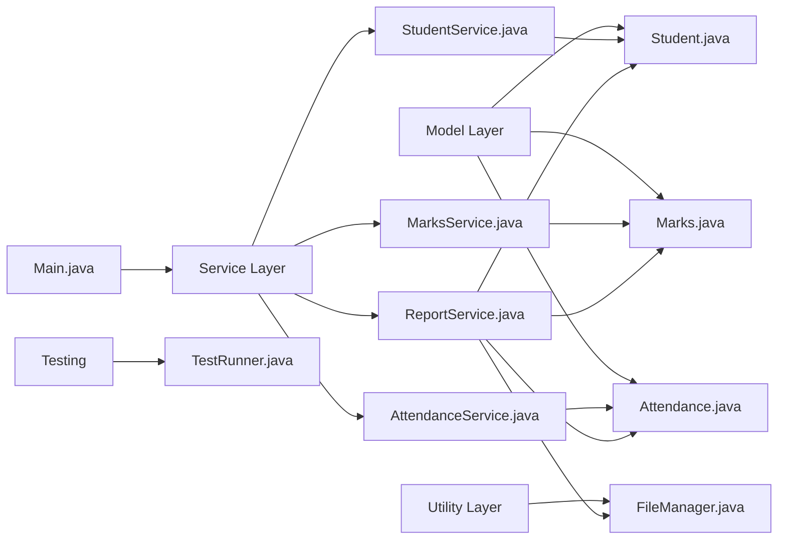
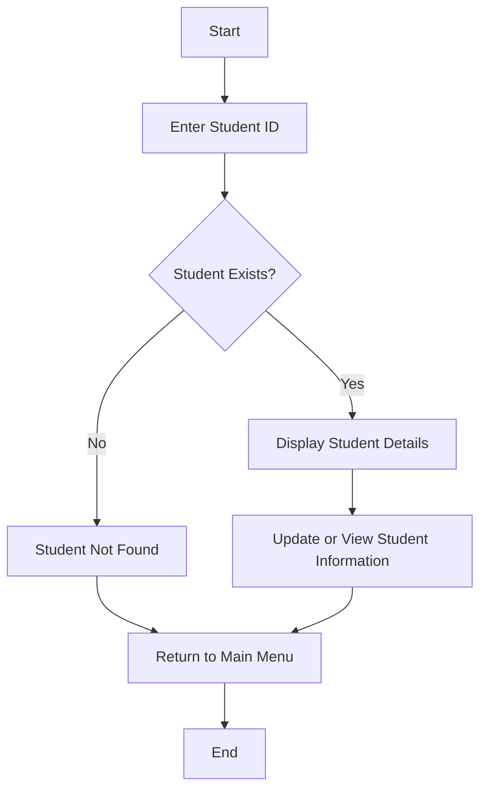
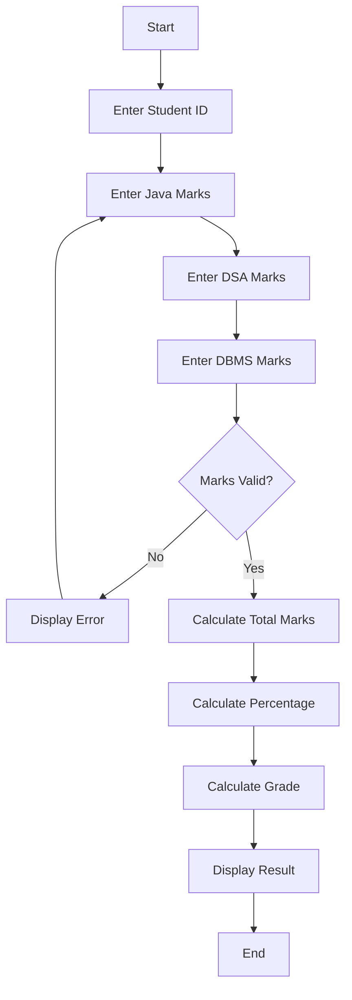
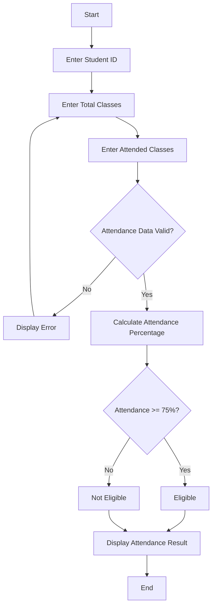
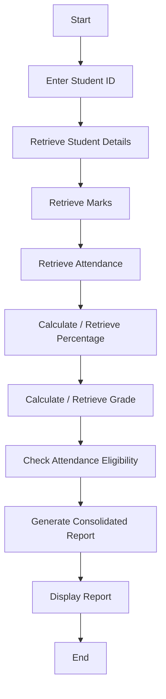
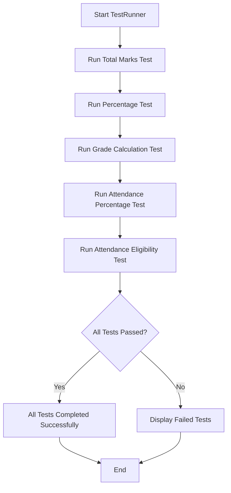
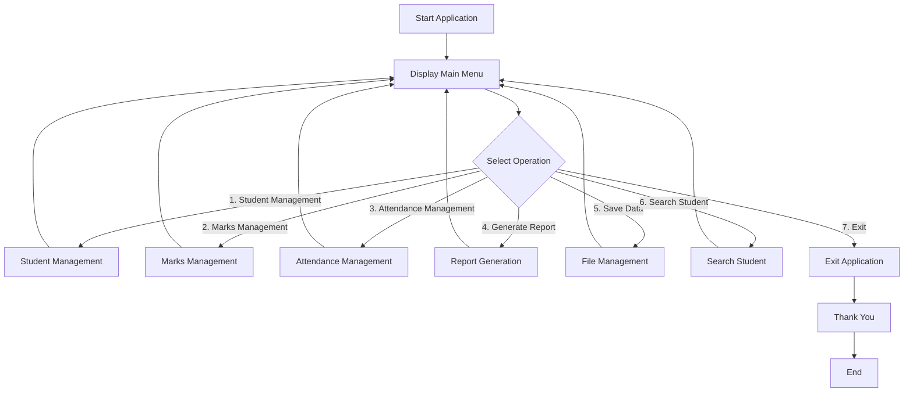
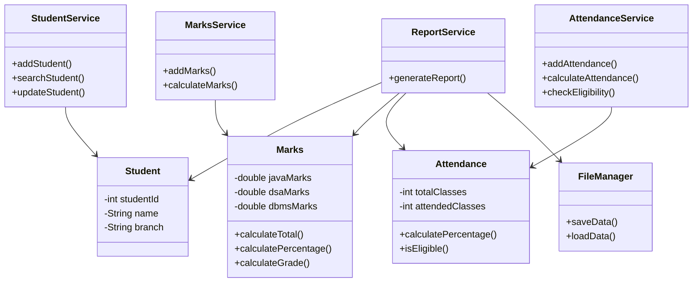

# Project Design Diagrams

## 1. System Architecture Diagram

---

## 2. Project Module Diagram

---

## 3. Student Management Flowchart

---

## 4. Marks Management Flowchart

---

## 5. Attendance Management Flowchart

---

## 6. Report Generation Flowchart

---

## 7. Testing Flowchart

---

## 8. Overall System Flow

---

## 9. Project Class Relationship

---

## 10. Test Results

The automated tests were executed using the Java test runner.

| Test | Result |
|---|---|
| Total Marks | PASS |
| Percentage | PASS |
| Grade Calculation | PASS |
| Attendance Percentage | PASS |
| Attendance Eligibility | PASS |

**All tests completed successfully!**
